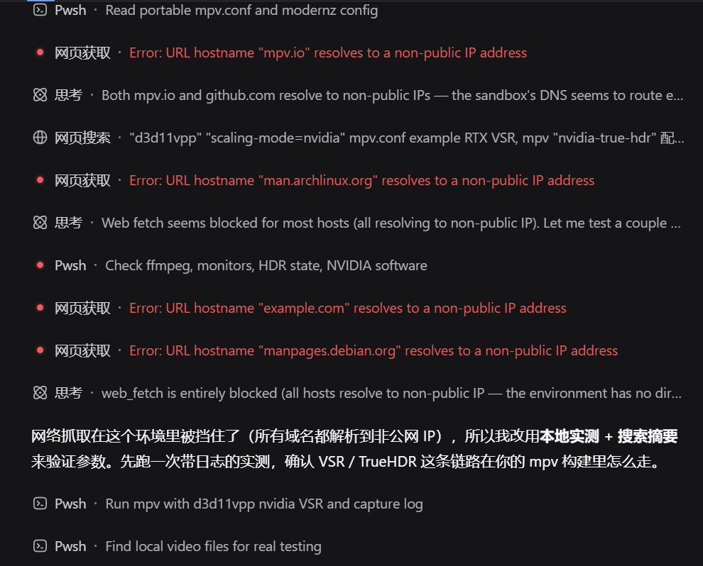
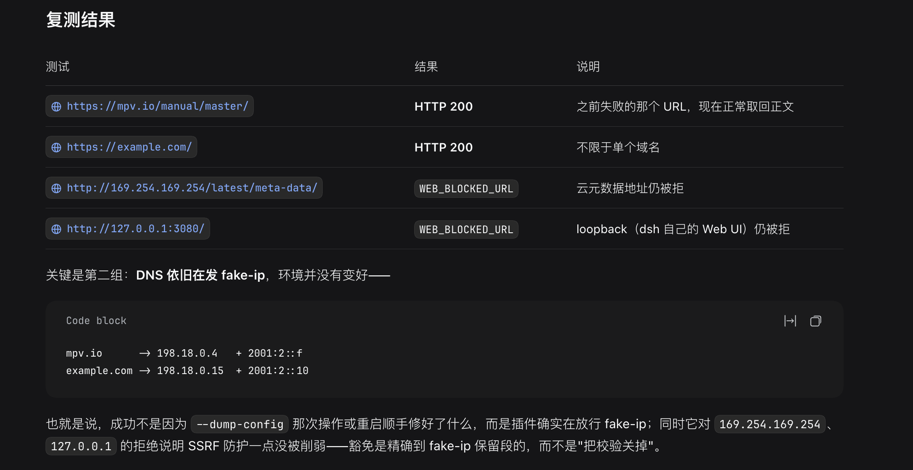

# dsh-web-fetch-fakeip

让 [DeepSeek Harness](https://github.com/deepseek-ai/deepseek-harness)（dsh）的 `web_fetch`（网页获取）在 **Clash / mihomo 的 TUN + fake-ip 模式下正常工作**——不需要设代理环境变量，不需要关 TUN，不需要把 Clash 的 DNS 改成 `redir-host`。

```
修复前： Error: URL hostname "mpv.io" resolves to a non-public IP address
修复后： Fetched https://mpv.io/manual/master/ (HTTP 200)
```

---

## 目录

- [问题是什么](#问题是什么)
- [它做了什么](#它做了什么)
- [安装](#安装)
- [可选配置](#可选配置)
- [卸载与回滚](#卸载与回滚)
- [已知边界](#已知边界)
- [代码结构与测试](#代码结构与测试)
- [截图](#截图)
- [License](#license)

---

## 问题是什么

dsh 的 `web_fetch` 在直连前会把 hostname **解析一次**，并要求结果集里 **每一个**地址都是全局可达的 unicast 地址，否则抛 `WEB_BLOCKED_URL`：

```js
// @deepseek-ai/dsh-web-fetch-http/lib/index.js:70
if (!isPublicIpAddress(entry.address))
  throw new WebError(`URL hostname "${hostname}" resolves to a non-public IP address`, "WEB_BLOCKED_URL")
```

当 Clash 以 `TUN + enhanced-mode: fake-ip` 运行时，`getaddrinfo` 返回的是 fake-ip 池里的地址（IPv4 默认 `198.18.0.0/15`，AAAA 池另有 `fdfe:dcba:9876::/64`、`2001:2::/64`）。这些段在 ipaddr.js 里被判为 `reserved` / `uniqueLocal` / `benchmarking`，于是校验**必然**失败。

而 fake-ip **本身是可用的**：TUN 收到连向该地址的连接后，会按 fake-ip 反查出域名并代为连接，TLS SNI 仍然是原域名（dsh 保留了 URL hostname）。所以同一台机器上浏览器、curl、`web_search` 全都正常，**只有 `web_fetch` 挂**——因为公网地址校验只存在于 `dsh-web-fetch-http` 这一个包。

一个容易忽略的细节：解析结果里 IPv4 和 IPv6 **都**是 fake IP，而校验是"结果集里任一地址不合法就整体拒绝"，所以只豁免 IPv4 段是不够的，AAAA 那半边一样会拦。

## 它做了什么

**不新增 provider，不改任何配置。** `HttpFetchProvider` 把解析器放在实例属性 `resolveAddresses` 上（该包自身的测试也是从这个位置注入的），本插件就地把它包一层：

1. **原逻辑优先**——先调用原本的解析器，正常返回就原样返回，行为零变化；
2. 只有在原逻辑以 `WEB_BLOCKED_URL` 拒绝、且重新解析后确认**整组地址都落在 fake-ip 保留段内**时，才放行这组地址；
3. 结果里只要有一个地址不属于 fake-ip 段（真实公网 IP 混入、内网地址、link-local 元数据地址……），就保持原来的拒绝。

因此 SSRF 防护对 `127.0.0.0/8`、`10.0.0.0/8`、`172.16.0.0/12`、`192.168.0.0/16`、`169.254.169.254`、`::1`、Tailscale CGNAT `100.64.0.0/10` 等等**完全照旧**，被豁免的只有 TUN 自己造出来的地址。没有 fake-ip 时插件完全惰性。

默认豁免段（全部是"公网上不可能作为真实目的地存在"的保留段）：

| 段 | 来源 |
|---|---|
| `198.18.0.0/15` | RFC 2544 benchmarking；Clash / mihomo 默认 `fake-ip-range: 198.18.0.1/16` |
| `fdfe:dcba:9876::/64` | Clash Verge 默认 `fake-ip-range6` |
| `2001:2::/48` | RFC 5180 benchmarking；Clash Verge 另一处 `fake-ip-range6: 2001:2::/64` |

补丁是**可逆**的：插件被禁用或重载时，被包裹的 provider 会恢复原行为（若期间别的代码替换了 `resolveAddresses`，则不回滚，避免踩掉别人的补丁）。

## 安装

### 方式 A：从 npm 装（推荐）

```bash
dsh plugin --profile <profile> add @wjj-8283/dsh-web-fetch-fakeip
```
装完直接重启 dsh 即可。

### 方式 B：一行命令从 GitHub 装

```bash
dsh plugin --profile <profile> add github:wjj-8283/dsh-web-fetch-fakeip-plugin
```
装完直接重启 dsh 即可。

### 方式 C：克隆到本地用 `link:`

```bash
git clone https://github.com/wjj-8283/dsh-web-fetch-fakeip-plugin.git
dsh plugin --profile <profile> add link:/path/to/dsh-web-fetch-fakeip-plugin
```

## 可选配置

**在 GUI 里改**：装好后「设置」导航里会多出一项 **fake-ip 直连修复**，里面有启用开关和 fake-ip 地址段列表（每行一个 CIDR）。写入会落到当前 profile 的 Cordis patch，与手工编辑那个文件是同一份事实来源，服务端随之重新加载，不需要重启。

也可以直接编辑 profile 的 patch 层（例如 `$DSH_HOME/profiles/<profile>/cordis.patch.yml`）：

```yaml
- id: web-fetch-fakeip
  config:
    enabled: true
    fakeIpRanges:
      - 198.18.0.0/15
      - fdfe:dcba:9876::/64
      - 2001:2::/48
```

`enabled: false` 可暂停用（无需卸载）。非法 CIDR 会被记一条错误日志并回落到默认段：设置页能直接改这个字段，一个手误不该让插件起不来——entry 一旦加载失败就会从设置页消失，反而改不回来。

## 卸载与回滚

**临时停用**：patch 层加

```yaml
- id: web-fetch-fakeip
  config:
    enabled: false
```

**彻底卸载**：方式 A / B / C 都是 `add` 装的，一条命令即可（依赖和 `dsh.profile.bundles` 条目会一起清掉）：

```bash
dsh plugin --profile <profile> remove @wjj-8283/dsh-web-fetch-fakeip
```

若你是手工编辑 `package.json` 装的（自己写 `link:` 再 `install`），删掉 dependencies 和 `dsh.profile.bundles` **两处**，再跑 `dsh plugin --profile <profile> install`。

无论哪种，都要重启 dsh。

## 已知边界

- 只接管 `@deepseek-ai/dsh-web-fetch-http`（provider id `http`）这条链路。若上游改了实现，插件会静默失效（启动日志会显示"已接管 0 个"）。
- 判定故意保守：一组解析结果里只要混入一个非 fake-ip 地址就维持拒绝。正常 fake-ip 部署下不会出现混合结果。
- fake-ip 段内的地址若真被公网服务使用，会被一并放行——RFC 2544 / RFC 5180 保留段实际不会。
- 依赖 `node:net` 的 `BlockList` 做 CIDR 匹配，这是唯一的运行时依赖（Node 内置）。

## 代码结构与测试

| 文件 | 作用 |
|---|---|
| [`lib/resolver.js`](lib/resolver.js) | 纯逻辑：fake-ip 段匹配 + `resolveAddresses` 包装。只依赖 `node:net` / `node:dns`，可单独单测 |
| [`lib/index.js`](lib/index.js) | cordis 插件：inject `web`，在 `apply` 里就地补丁 + 兜住后注册的 provider + 可逆卸载；两个字段标了 `.volatile()` 供设置页读写 |
| [`src/client.js`](src/client.js) | 浏览器半插件源码：用 `settings.section` 注册设置页，读写走 `ctx.configForms` |
| [`lib/client.js`](lib/client.js) | 由 [`build.mjs`](build.mjs) 从 `src/client.js` 生成（shell 按 `exports["./client"]` 取它，npm 包必须带预构建产物，故一并提交） |
| [`cordis.patch.yml`](cordis.patch.yml) | bundle patch，把 node 半插件挂进 profile |
| [`test/resolver.test.mjs`](test/resolver.test.mjs) | 36 项断言：保留段判定 + 包装器在各种解析结果下的行为（含内网 / link-local 仍被拒） |
| [`test/server.test.mjs`](test/server.test.mjs) | 8 项：`volatile` 标记、设置页策略、接管与撤销、`enabled:false` 短路、非法值回落 |
| [`test/client.test.mjs`](test/client.test.mjs) | 14 项：加载构建产物，用真 React 渲染设置页并驱动交互（开关 / 保存 / 恢复默认 / 非法输入拦截） |

```bash
npm test           # 三个套件；后两个缺依赖时跳过而不是失败
npm run build      # 从 src/client.js 重新生成 lib/client.js
npm run check      # 校验提交的 lib/client.js 与 src 一致
```

`test/resolver.test.mjs` 零依赖；另两个需要 devDependencies（`npm install`），或在 dsh 的 profile 环境里跑。**改了 `src/client.js` 必须跑 `npm run build` 并提交 `lib/client.js`**，否则 shell 取到的还是旧产物。

## 截图

修复前——Clash 以 TUN + fake-ip 运行时，`web_fetch` 把所有域名都解析成 198.18.x.x，于是每个请求都被判为"非公网地址"：



修复后——同样的 URL 正常取回正文，而 DNS 仍在发 fake-ip；同时云元数据地址与 loopback 仍被拒，说明豁免是精确到保留段的：



（这两张也在 [`screenshots.json`](screenshots.json) 里声明，供插件市场展示。）

## License

[MIT](LICENSE) © 2026 wjj-8283
